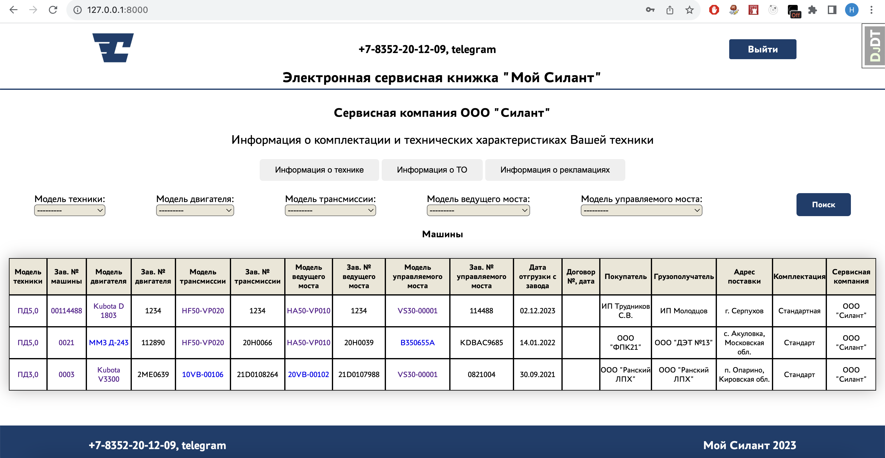
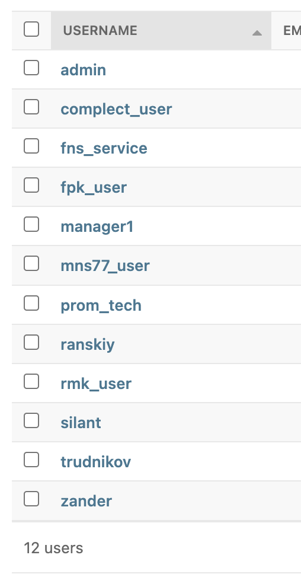

### Электронная сервисная книжка "Мой Силант"

____

#### Главная страница для авторизованного пользователя





#### Список пользователей для тестирования

Для пользователя admin пароль admin
Для всех остальных пользователей пароль 123456789K!



______

### Запуск приложения

```
git clone https://github.com/molodcovnik/finaly_project.git
cd finaly_project/
python3 -m venv venv
source venv/bin/activate
pip install -r requirements.txt
cd silant/
python manage.py  runserver
```
